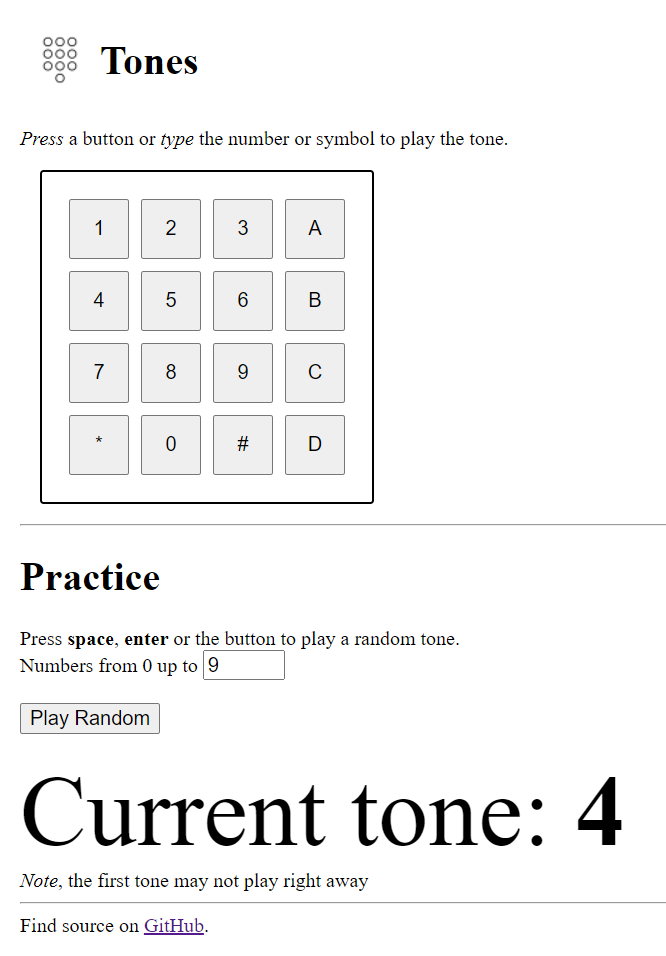

#  [DTMF Tone Player](https://quittle.github.io/dtmf-tone-player) 

Learn to identify "Dual tone multi frequency" notes used by phones.

[Jump to live demo!](https://quittle.github.io/dtmf-tone-player)

|                 Website Preview |
| ------------------------------: |
|  |

# Build and Usage

No build necessary, just open [`index.html`](./index.html).

Try to keep the formatting nice with Prettier.
